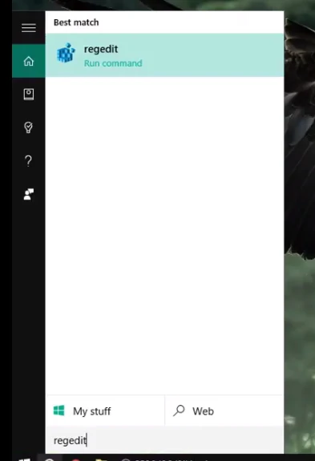
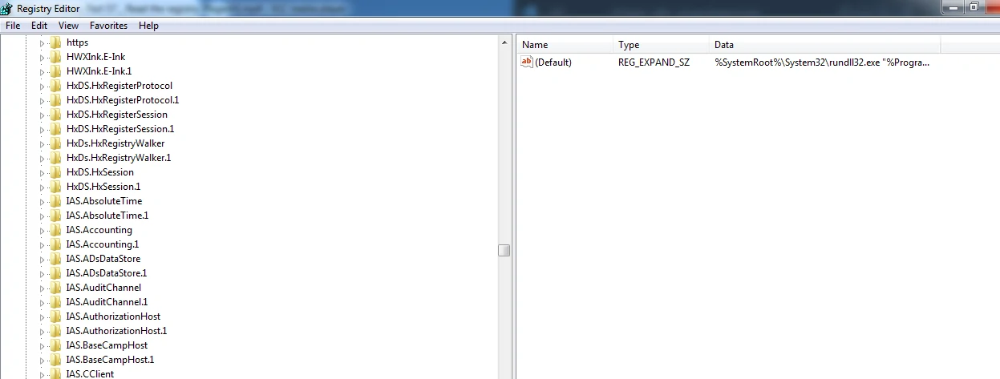
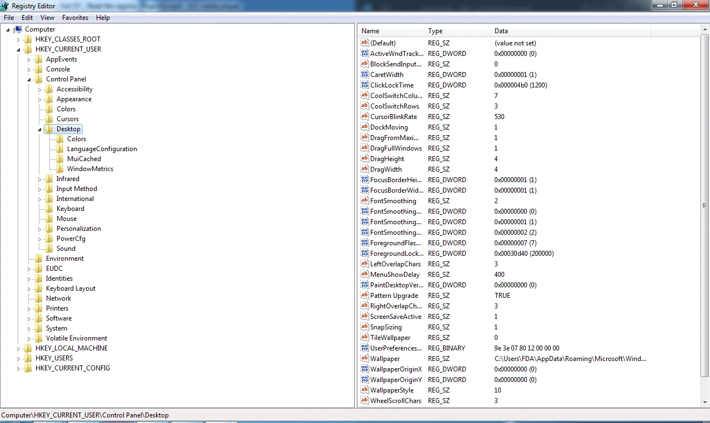
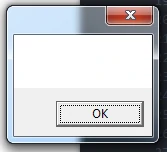
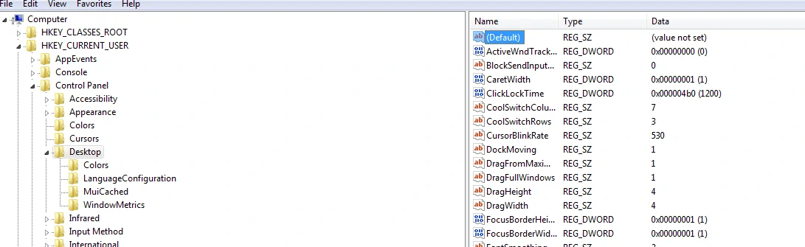
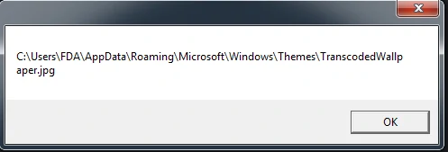
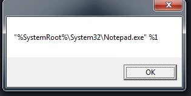

# Read the registry (Regedit)

## Membuka regedit

### search regedit




---

## regedit desktop



```vbs
Set cmd CreateObject("wscript.shell")

MsgBox cmd.RegRead("HKCU\Control Panel\Desktop\")
```

> Hasil : black



> kenapa blank?
> karena defaultnya no set



## Menampilkan walpaper desktop

```vbs
Set cmd CreateObject("wscript.shell")

MsgBox cmd.RegRead("HKCU\Control Panel\Desktop\wallpaper")
```

> Hasil :



## Membaca Edit dari file vbs

```vbs
Set cmd CreateObject("wscript.shell")

MsgBox cmd.RegRead("HKCR\VBSFile\Shell\Edit\Command")
```

> Hasil :

