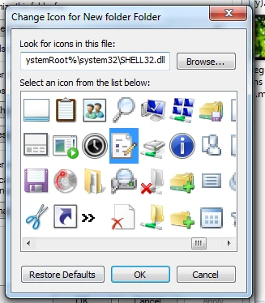
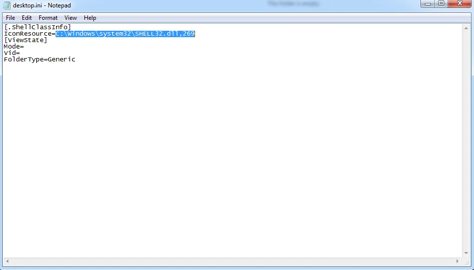
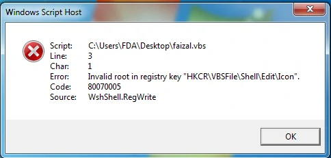
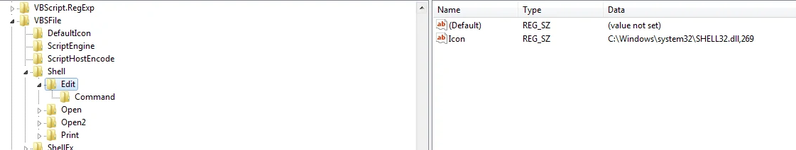
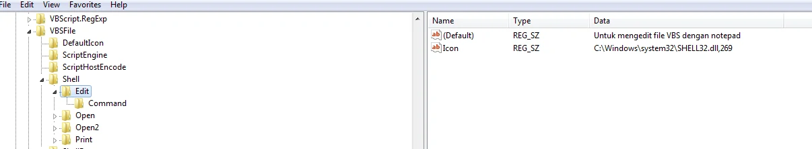
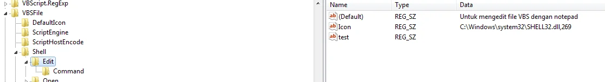
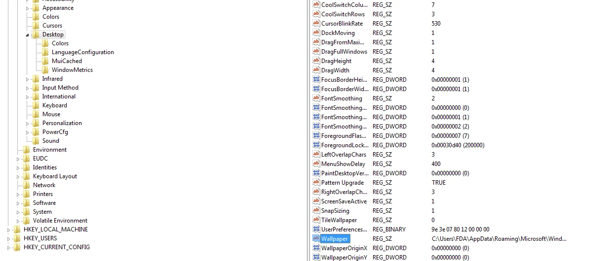

# Write to the registry

## Mengedit icon dari edit di file vbs

- buat folder baru didesktop
- ganti iconnya



- masuk ke folder dan tambahkan diURL /desktop.ini
- copy ini
  


- masuk kan di code
```vbs
Set cmd CreateObject("wscript.shell")

cmd.RegWrite "HKCR\VBSFile\Shell\Edit\Icon", "C:\Windows\system32\SHELL32.dll, 269", "REG_SZ"
```

> Hasil :



- tidak bisa masuk karena kita bukan admin

## solusi

```vbs
runasadmin()
Set cmd = CreateObject("wscript.shell")

cmd.RegWrite "HKCR\VBSFile\Shell\Edit\Icon", "C:\Windows\system32\SHELL32.dll,269", "REG_SZ"
MsgBox "Finished"

Function runasadmin()
    Dim objapp
    If WScript.Arguments.length = 0 Then
        Set objapp = CreateObject("shell.application")
        objapp.shellExecute "Wscript.exe", """" & _
            WScript.ScriptFullName & """" & " RunAsAdministrator", "runas", 1
        WScript.Quit
    End If
End Function
```

- maka edit di file VBS akan ada iconnya



## Mengedit default dari file VBS

```vbs
runasadmin()
Set cmd = CreateObject("wscript.shell")

cmd.RegWrite "HKCR\VBSFile\Shell\Edit\", "Untuk mengedit file VBS dengan notepad", "REG_SZ"
MsgBox "Finished"

Function runasadmin()
    Dim objapp
    If WScript.Arguments.length = 0 Then
        Set objapp = CreateObject("shell.application")
        objapp.shellExecute "Wscript.exe", & """" & _
            WScript.ScriptFullName & """" & " RunAsAdministrator", "runas", 1
        WScript.Quit
    End If
End Function
```

> Hasil :



## Menambahkan tanpa hasil

```vbs
runasadmin()
Set cmd = CreateObject("wscript.shell")

cmd.RegWrite "HKCR\VBSFile\Shell\Edit\test", "", "REG_SZ"
MsgBox "Finished"

Function runasadmin()
    Dim objapp
    If WScript.Arguments.length = 0 Then
        Set objapp = CreateObject("shell.application")
        objapp.shellExecute "Wscript.exe", """" & _
            WScript.ScriptFullName & "**" & " RunAsAdministrator", , "runas", 1
        WScript.Quit
    End If
End Function
```



## Mengubah walpaper desktop

### cara ubah lewat regedit



### lewat coding
```vbs
Set cmd CreateObject("wscript.shell")
change_Wall = "c:\users\fda\desktop\walpaper.jpg"

cmd.RegWrite "HKCU\Control Panel\desktop\wallpaper", change_wall, "REG_SZ"

cmd.run "RUNDLL32.exe user32.d11, UpdatePerUserSystemParameters"

MsgBox "ok"
```
