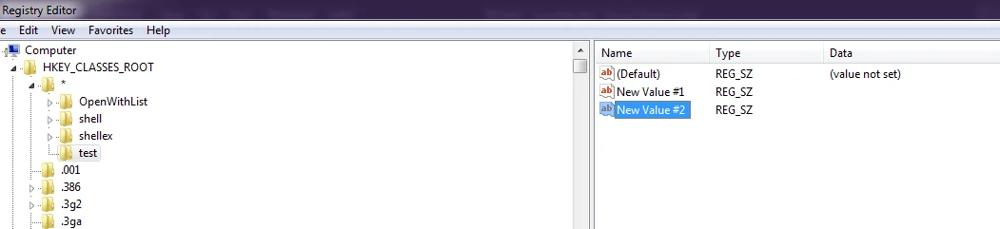

# Delete items in registry

## Menghapus test regedit

```vb
RunAsAdmin()
Set cmd = CreateObject("wscript.shell")

cmd.RegDelete "HKCR\*\test\test2"
MsgBox "Finished"

Function RunAsAdmin()
    Dim objApp
    If WScript.Arguments.length = 0 Then
        Set objApp = CreateObject("shell.application")
        objApp.shellExecute "wscript.exe", """" & _
            WScript.ScriptFullName & """" & " RunAsAdministrator", , "runas", 1
        WScript.quit
    End If
End Function
```

## menghapus semua kecuali file default diregedit



```vb
RunAsAdmin()
Set cmd CreateObject("wscript.shell")

cmd.RegDelete "HKCR\*\test\"
MsgBox "Finished"

Function RunAsAdmin()
    Dim objApp
    If WScript.Arguments.length = 0 Then
        Set objApp = CreateObject("shell.application")
        objApp.shellExecute "wscript.exe", """" & _
            WScript.ScriptFullName & """" & " RunAsAdministrator", "runas", 1
        WScript.quit
    End If
End Function
```