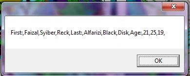
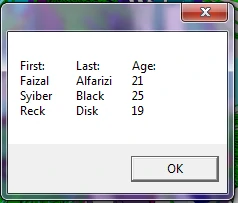

# Join Mutidimensional Arrays

## contoh 1

```vb
Dim multD(3, 2)

multD(0, 0) = "First:"
multD(0, 1) = "Last:"
multD(0, 2) = "Age:"

multD(1, 0) = "Faizal"
multD(1, 1) = "Alfarizi"
multD(1, 2) "21"

multD(2, 0) = "Syiber"
multD(2, 1) = "Black"
multD(2, 2) = "25"

multD(3, 0) "Reck"
multD(3, 1) = "Disk"
multD(3, 2) = "19"

MsgBox mJoin(multD, "")

'join 
Function mJoin(list, delimiter)
    For Each item In list
        allitems = allitems & item & delimiter
    Next
    mJoin allitems
End Function
```

> Hasil :


## Contoh 2

```vb
Dim
multD(3, 2)
multD(0, 0) = "First:"
multD(0, 1) = "Last:"
multD(0, 2) = "Age:"

multD(1, 0) = "Faizal"
multD(1, 1) = "Alfarizi"
multD(1, 2) "21"

multD(2.0) = "Syiber"
multD(2, 1) = "Black"
multD(2, 2) "25"

multD(3, 0) = "Reck"
multD(3, 1) = "Disk"
multD(3, 2) "19"

MsgBox MJoin(multD, "")

'join 

Function mJoin(List, delimiter)
    For Each item In list allitems
        allitems & item & delimiter
    Next
    mJoin = allitems
End Function
```



---

```vb
Dim multD(3, 2)
multD(0, 0) = "First:"
multD(0, 1) - "Last:"
multD(0, 2) "Age:"

multD(1, 0) - "Faizal"
multD(1, 1) = "Alfarizi"
multD(1, 2) = "21"

multD(2, 8) = "Syiber"
multD(2, 1) "Black"
multD(2, 2) = "25"

multD(3, 6) = "Reck"
multD(3, 1) = "Disk"
multD(3, 2) = "19"

MsgBox Split(mJoin(multD, ","), ",")(0)

' Join 

Function mJoin(List, delimiter)
    For Each item In list
        allitems = allitems & item & delimiter
    Next
    mJoin = allitems
End Function
```


> hasilnya sama :

```vb
Dim multD(3, 2)
multD(0, 0) = "First:"
multD(0, 1) - "Last:"
multD(0, 2) "Age:"

multD(1, 0) - "Faizal"
multD(1, 1) = "Alfarizi"
multD(1, 2) = "21"

multD(2, 8) = "Syiber"
multD(2, 1) "Black"
multD(2, 2) = "25"

multD(3, 6) = "Reck"
multD(3, 1) = "Disk"
multD(3, 2) = "19"

joined Split(mJoin(multD, ","), ",")
MsgBox joined(0)

' Join 

Function mJoin(List, delimiter)
    For Each item In list
        allitems = allitems & item & delimiter
    Next
    mJoin = allitems
End Function
```

---

```vb
Dim multD(3, 2)
multD(0, 0) = "First:"
multD(0, 1) - "Last:"
multD(0, 2) "Age:"

multD(1, 0) - "Faizal"
multD(1, 1) = "Alfarizi"
multD(1, 2) = "21"

multD(2, 8) = "Syiber"
multD(2, 1) "Black"
multD(2, 2) = "25"

multD(3, 6) = "Reck"
multD(3, 1) = "Disk"
multD(3, 2) = "19"

MsgBox mDJoin(multD)

' Join for displaying
Function mDJoin(List)
    For r = 0 To UBound(list, 1) : For c = 0 To UBound(multD, 2)
            If c = 0 And Not r 0 Then
                allitems = allitems & vbLf
            End If allitems
            allitems & list(r, c) & vbTab
        Next : Next

    mDJoin = allitems
End Function
```

> Hasil :


